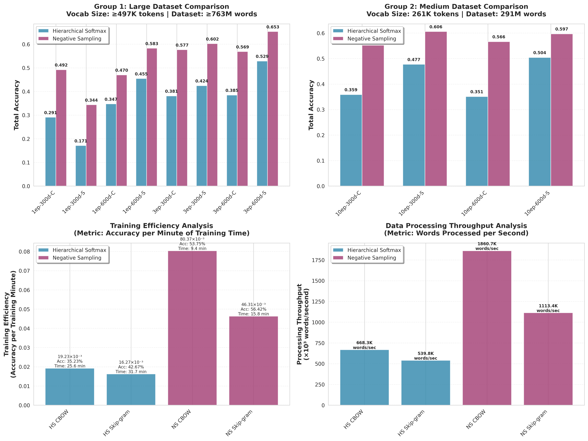
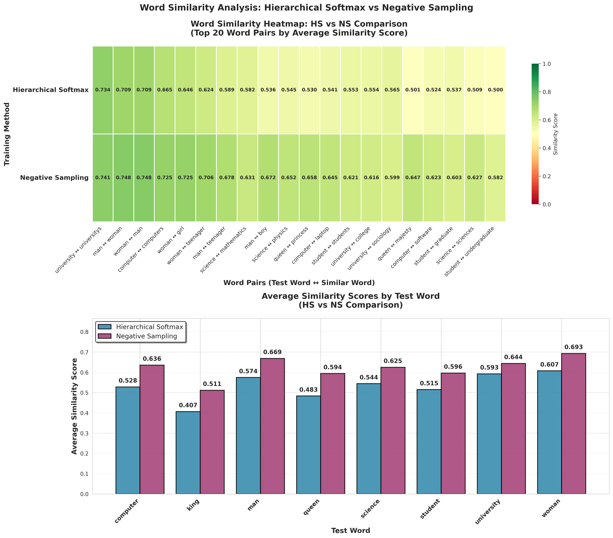

# Word2Vec PyCUDA

A complete implementation of Word2Vec with both CBOW and Skip-gram models using Numba CUDA for GPU acceleration. This implementation includes Hierarchical Softmax (HS), Negative Sampling (NS), Exponential Table optimization, and Phrase Detection.

## Features

- **Two Models**: Complete implementations of both CBOW and Skip-gram architectures
- **GPU Acceleration**: Uses Numba CUDA for fast training on GPU
- **Multiple Training Methods**: 
  - Negative Sampling (NS) only
  - Hierarchical Softmax (HS) only
- **Datasets Support**: 
  - Text8 corpus (~17M words)
  - WMT14/WMT15 News corpus (combines 2012-2014, up to 800M+ words)
- **Phrase Detection**: Automatic phrase detection (e.g., "new york" → "new_york")
- **Learning Rate Decay**: Linear learning rate decay within each epoch (as per original word2vec.c)
- **Vocabulary Caching**: Efficient vocabulary building with caching mechanism
- **Evaluation**: Word analogy test and similarity metrics
- **Interactive Menu**: User-friendly command-line interface
- **Selective Training**: Option to train only Skip-gram or only CBOW

## Architecture

Based on the original Word2Vec paper by Mikolov et al. (2013):
- **Skip-gram**: Predicts context words from center word
- **CBOW**: Predicts center word from context words
- **Negative Sampling**: Efficient training with negative samples (k=5)
- **Hierarchical Softmax**: Huffman tree-based efficient word prediction
- **Subsampling**: Reduces frequent words to improve quality
- **Exponential Table**: Precomputed sigmoid values for faster training
- **Linear LR Decay**: Learning rate decreases linearly within each epoch

## Requirements

- Python 3.8+
- CUDA-capable GPU (T4 recommended for Colab)
- Poetry for dependency management (optional)

## Installation

### Using Poetry (Recommended)

1. Install Poetry if you haven't already:
   ```bash
   pip install poetry
   ```

2. Clone the repository:
   ```bash
   git clone https://github.com/tanh1c/Word2Vec-PyCUDA.git
   cd Word2Vec-PyCUDA
   ```

3. Install dependencies:
   ```bash
   poetry install
   ```

4. Activate the virtual environment:
   ```bash
   poetry shell
   ```

### For Google Colab:

1. Upload all files to Colab
2. Run the setup script:
   ```bash
   !python Notebook/colab_setup_all.py
   ```
3. Run the complete pipeline:
   ```bash
   !python Notebook/run_all_notebook.py
   ```

### Alternative: Using pip (without Poetry)

If you prefer using pip directly:

```bash
pip install numba-cuda==0.4.0 numpy>=1.20.0 scikit-learn>=1.0.0 matplotlib>=3.5.0 seaborn>=0.11.0 tqdm>=4.60.0 requests>=2.25.0 pynvml>=11.0.0 pandas>=1.3.0
```

## Usage

### Interactive Menu (Recommended)

Run the interactive menu for easy configuration:

```bash
python run_all.py
```

This will guide you through:
1. Dataset selection (Text8, WMT14/WMT15 News)
2. Training method (NS only, HS only)
3. Dataset size (for WMT14: Full, Tiny, Small, Medium, Custom words limit)
4. Model selection (Both, Skip-gram only, CBOW only)
5. Phrase detection (Yes/No)
6. Stop after evaluation (Yes/No)

### Command Line Options

You can also use command-line arguments:

```bash
# Train with specific options
python run_all.py --dataset text8 --method ns --phrases

# Train only Skip-gram
python run_all.py --dataset wmt14 --method ns --skip-gram-only

# Train only CBOW
python run_all.py --dataset wmt14 --method hs --cbow-only

# Stop after evaluation (skip visualization)
python run_all.py --stop-after-eval

# Use specific dataset size
python run_all.py --dataset wmt14 --size tiny
```

### Individual Components

You can also use individual modules:

```python
from w2v_skipgram import train_skipgram
from w2v_cbow import train_cbow
from evaluation import word_analogy_test, similarity_test

# Train Skip-gram with NS only
train_skipgram(
    data_path="./data/text8_processed",
    output_path="./output/vectors_skipgram",
    epochs=10,
    embed_dim=100,
    min_occurs=5,
    hs=0,  # Disable Hierarchical Softmax
    negative=5  # Enable Negative Sampling (k=5)
)

# Train CBOW with HS only
train_cbow(
    data_path="./data/text8_processed",
    output_path="./output/vectors_cbow",
    epochs=10,
    embed_dim=100,
    min_occurs=5,
    hs=1,  # Enable Hierarchical Softmax
    negative=0  # Disable Negative Sampling
)

# Evaluate
accuracy, details = word_analogy_test("./output/vectors_skipgram")
similarity_results = similarity_test("./output/vectors_skipgram")
```

## Hyperparameters

Default parameters (based on Mikolov's paper):

| Parameter | Value | Description |
|-----------|-------|-------------|
| `embed_dim` | 100 | Embedding dimension (tested: 300, 600) |
| `window` | 5 | Context window size |
| `negative_samples` | 5 | Number of negative samples (NS only) |
| `min_count` | 5 | Minimum word frequency |
| `epochs` | 10 | Training epochs (tested: 1, 3, 10) |
| `lr_max` | 0.025 | Initial learning rate |
| `lr_min` | 0.0001 | Final learning rate |
| `subsampling_threshold` | 1e-5 | Subsampling threshold |
| `freq_exponent` | 0.75 | Frequency exponent for negative sampling |
| `exp_table_size` | 1000 | Exponential table size for fast sigmoid |
| `max_exp` | 6 | Maximum exponent value |

## Output Files

The pipeline generates the following outputs in `./output/`:

### Model Files
- `vectors_skipgram`: Skip-gram word vectors (word2vec format)
- `vectors_cbow`: CBOW word vectors (word2vec format)
- `*_params.json`: Training parameters
- `*_stats.json`: Training statistics

### Evaluation Files
- `skipgram_eval.json`: Skip-gram evaluation results
- `cbow_eval.json`: CBOW evaluation results
- `model_comparison.json`: Detailed model comparison

## Performance

Actual performance results on WMT14/WMT15 News dataset with various configurations:

### Negative Sampling (NS) Results

#### Training Time (seconds)

| Config | Skip-gram | CBOW | Skip-gram/epoch | CBOW/epoch |
|--------|-----------|------|-----------------|------------|
| 1 epoch, 300 dim, 800M words | 257.5 | 155.1 | 257.5 | 155.1 |
| 1 epoch, 600 dim, 833M words | 552.7 | 322.9 | 552.7 | 322.9 |
| 3 epoch, 300 dim, 800M words | 778.6 | 484.6 | 259.5 | 161.5 |
| 3 epoch, 600 dim, 800M words | 1474.7 | 818.9 | 491.6 | 272.9 |
| 10 epoch, 300 dim, 291M words | 892.0 | 562.1 | 89.2 | 56.2 |
| 10 epoch, 600 dim, 291M words | 1724.4 | 1042.1 | 172.4 | 104.2 |

#### Accuracy (Word Analogy Test)

| Config | Skip-gram Semantic | Skip-gram Syntactic | Skip-gram Total | CBOW Semantic | CBOW Syntactic | CBOW Total |
|--------|-------------------|---------------------|-----------------|---------------|----------------|------------|
| 1 epoch, 300 dim | 31.64% | 35.15% | **34.36%** | 37.24% | 52.67% | **49.20%** |
| 1 epoch, 600 dim | 52.57% | 59.96% | **58.30%** | 32.38% | 51.24% | **47.00%** |
| 3 epoch, 300 dim | 57.68% | 60.97% | **60.23%** | 49.81% | 59.92% | **57.65%** |
| 3 epoch, 600 dim | 62.93% | 66.04% | **65.34%** | 46.35% | 59.91% | **56.86%** |
| 10 epoch, 300 dim | 57.25% | 61.54% | **60.58%** | 45.96% | 57.90% | **55.21%** |
| 10 epoch, 600 dim | 57.12% | 60.45% | **59.70%** | 47.64% | 59.24% | **56.61%** |

**Best NS Configuration**: 3 epochs, 600 dimensions → **65.34%** accuracy (Skip-gram), **56.86%** (CBOW)

### Hierarchical Softmax (HS) Results

#### Training Time (seconds)

| Config | Skip-gram | CBOW | Skip-gram/epoch | CBOW/epoch |
|--------|-----------|------|-----------------|------------|
| 1 epoch, 300 dim, 800M words | 544.7 | 442.2 | 544.7 | 442.2 |
| 1 epoch, 600 dim, 764M words | 1008.5 | 801.8 | 1008.5 | 801.8 |
| 3 epoch, 300 dim, 783M words | 1533.3 | 1251.0 | 511.1 | 417.0 |
| 3 epoch, 600 dim, 764M words | 2966.0 | 2356.5 | 988.7 | 785.5 |
| 10 epoch, 300 dim, 291M words | 1796.3 | 1492.0 | 179.6 | 149.2 |
| 10 epoch, 600 dim, 291M words | 3568.2 | 2857.3 | 356.8 | 285.7 |

#### Accuracy (Word Analogy Test)

| Config | Skip-gram Semantic | Skip-gram Syntactic | Skip-gram Total | CBOW Semantic | CBOW Syntactic | CBOW Total |
|--------|-------------------|---------------------|-----------------|---------------|----------------|------------|
| 1 epoch, 300 dim | 14.55% | 17.82% | **17.09%** | 12.00% | 34.07% | **29.10%** |
| 1 epoch, 600 dim | 37.35% | 47.82% | **45.47%** | 13.88% | 40.79% | **34.74%** |
| 3 epoch, 300 dim | 35.39% | 44.49% | **42.45%** | 17.27% | 44.18% | **38.12%** |
| 3 epoch, 600 dim | 46.93% | 54.60% | **52.88%** | 16.31% | 44.92% | **38.48%** |
| 10 epoch, 300 dim | 40.91% | 49.72% | **47.72%** | 15.87% | 41.72% | **35.86%** |
| 10 epoch, 600 dim | 46.68% | 51.51% | **50.42%** | 15.54% | 40.85% | **35.10%** |

**Best HS Configuration**: 3 epochs, 600 dimensions → **52.88%** accuracy (Skip-gram), **38.48%** (CBOW)

### Comparison: NS vs HS

**Key Findings:**
- **NS is faster**: NS training is ~2-3x faster than HS for same configurations
- **NS achieves higher accuracy**: Best NS accuracy (65.34%) significantly outperforms best HS accuracy (52.88%)
- **Skip-gram generally better**: Skip-gram consistently outperforms CBOW for both NS and HS
- **Higher dimensions help**: 600-dim embeddings show better accuracy than 300-dim
- **More epochs improve accuracy**: 3-10 epochs show better results than 1 epoch

**Example Similarity Results** (3 epoch, 600 dim, NS):
- `king - queen: 0.5412`
- `man - woman: 0.7472`
- `computer - software: 0.6164`
- `university - college: 0.6490`

### Performance Visualization

The following graphs provide comprehensive visualizations of the performance comparison between HS and NS methods:

#### Fair Comparison: Accuracy and Efficiency Analysis



This graph shows a fair comparison between HS and NS methods, grouped by similar dataset sizes:

- **Group 1 (Top Left)**: Large dataset comparison (vocab size ≥497K, dataset ≥763M words) - Shows NS consistently outperforms HS in accuracy across all configurations
- **Group 2 (Top Right)**: Medium dataset comparison (vocab size 261K, dataset 291M words) - Similar trend with NS achieving higher accuracy
- **Training Efficiency (Bottom Left)**: Accuracy per minute of training time - NS models achieve significantly higher efficiency (NS CBOW: 80.37×10⁻³, NS Skip-gram: 46.31×10⁻³) compared to HS models
- **Processing Throughput (Bottom Right)**: Words processed per second - NS models process data 2-3x faster than HS models (NS CBOW: 1860.7K words/sec vs HS CBOW: 668.3K words/sec)

**Key Insight**: Negative Sampling provides both higher accuracy and better computational efficiency compared to Hierarchical Softmax.

#### Word Similarity Analysis



This graph compares word similarity scores between HS and NS methods:

- **Top Heatmap**: Shows similarity scores for top 20 word pairs (e.g., `man ↔ woman`, `university ↔ universitys`, `computer ↔ computers`). NS consistently shows higher similarity scores across all pairs
- **Bottom Bar Chart**: Average similarity scores by test word - NS outperforms HS for all 8 test words (king, queen, man, woman, computer, science, university, student)

**Key Insight**: Negative Sampling captures semantic relationships more effectively, with higher similarity scores for related word pairs.

### Memory Usage

- **GPU Memory**: Varies by vocabulary size and embedding dimensions
- **Model Size**: `vocab_size × embed_dim` parameters per model
- **Example**: 520,233 vocabulary × 600 dimensions = ~312M parameters per model
- **Efficient**: Optimized for T4 GPU (15GB) with room for larger datasets

## Technical Details

### CUDA Implementation

- Uses Numba CUDA for GPU acceleration
- Custom kernels for both Skip-gram and CBOW
- Efficient memory management for T4 GPU
- Parallel processing across all training examples
- Exponential table for fast sigmoid computation
- Early skip logic for gradient stability

### Learning Rate Scheduling

- **Linear decay within epoch**: Learning rate decreases linearly from `lr_max` to `lr_min` based on words processed
- **Epoch-based reset**: Learning rate resets to `lr_max` at the start of each new epoch
- **Implementation**: Matches the original word2vec.c behavior

### Hierarchical Softmax

- Huffman tree construction based on word frequencies
- Efficient binary tree traversal for word prediction
- Reduced computation complexity from O(V) to O(log V)
- Syn1 weight matrix for internal tree nodes

### Negative Sampling

- Dynamic table size based on vocabulary size
- Frequency-based negative sample selection (k=5)
- Efficient GPU parallel sampling

### Vocabulary Caching

- Automatically caches built vocabulary based on dataset path, min_occurs, and freq_exponent
- Significantly speeds up training when reusing same vocabulary settings
- Cache files stored in `./data/vocab_cache/`

### Phrase Detection

- Two-pass phrase detection algorithm
- Score-based phrase identification
- Automatic phrase rewriting in data files
- Compatible with original word2phrase.c implementation

## Troubleshooting

### Common Issues

1. **CUDA not available**: Check GPU availability with `numba.cuda.is_available()`
2. **Out of memory**: Reduce `embed_dim` or `cuda_threads_per_block`
3. **Slow training**: Ensure GPU is being used, not CPU
4. **Import errors**: Install all required dependencies using pip or Poetry
5. **Overflow warnings**: Handled automatically with int64 casting for large datasets

### Memory Optimization

For limited GPU memory:
- Reduce `embed_dim` to 300 or lower
- Decrease `cuda_threads_per_block` to 256
- Use smaller context window (`window=3`)
- Limit dataset size using `max_words` parameter

## Project Structure

```
w2v_implementation/
├── w2v_common.py          # Common utilities, vocabulary, HS tree, exp table
├── w2v_cbow.py            # CBOW training implementation
├── w2v_skipgram.py        # Skip-gram training implementation
├── data_handler.py        # Data downloading and preprocessing
├── evaluation.py          # Evaluation (word analogy, similarity)
├── run_all.py            # Main pipeline script with interactive menu
├── Notebook/
│   ├── colab_setup_all.py        # Google Colab setup script
│   ├── run_all_notebook.py       # Notebook-adapted pipeline
│   └── W2V_Notebook_v1.ipynb     # Jupyter notebook
├── Result/
│   ├── HS/                       # Hierarchical Softmax results
│   │   ├── parse_results.py      # Parse HS result files to CSV
│   │   ├── parse_similarity.py   # Parse HS similarity data
│   │   └── *.csv                 # Result CSVs
│   ├── NS/                       # Negative Sampling results
│   │   ├── parse_results.py      # Parse NS result files to CSV
│   │   ├── parse_similarity.py   # Parse NS similarity data
│   │   └── *.csv                 # Result CSVs
│   ├── compare_HS_vs_NS.py       # Generate comparison graphs
│   └── compare_similarity.py     # Generate similarity comparison graphs
├── pyproject.toml        # Poetry dependencies
├── requirements.txt      # pip dependencies (legacy)
└── README.md            # This file
```

## Result Analysis

The project includes scripts for parsing and analyzing training results:

### Parse Results to CSV

```bash
# Parse HS results
cd Result/HS
python parse_results.py
python parse_similarity.py

# Parse NS results
cd Result/NS
python parse_results.py
python parse_similarity.py
```

This generates:
- `*_results_wide.csv`: One row per configuration (wide format)
- `*_results_long.csv`: One row per model (long format)
- `*_similarity_long.csv`: Similarity scores in long format
- `*_similarity_by_word.csv`: Similarity organized by test words
- `*_similarity_matrix.csv`: Similarity matrix format

### Generate Comparison Graphs

```bash
cd Result
python compare_HS_vs_NS.py      # Compare NS vs HS accuracy and training time
python compare_similarity.py    # Compare similarity scores between methods
```

## References

- Mikolov, T., et al. (2013). "Efficient Estimation of Word Representations in Vector Space"
- Mikolov, T., et al. (2013). "Distributed Representations of Words and Phrases and their Compositionality"
- Original word2vec implementation: https://code.google.com/archive/p/word2vec/

## License

This implementation is based on the original word2vec project and follows the GNU Lesser General Public License (LGPL-3.0).

## Contributing

Feel free to submit issues and enhancement requests!

## Author

- **tanh1c** - [GitHub](https://github.com/tanh1c)
